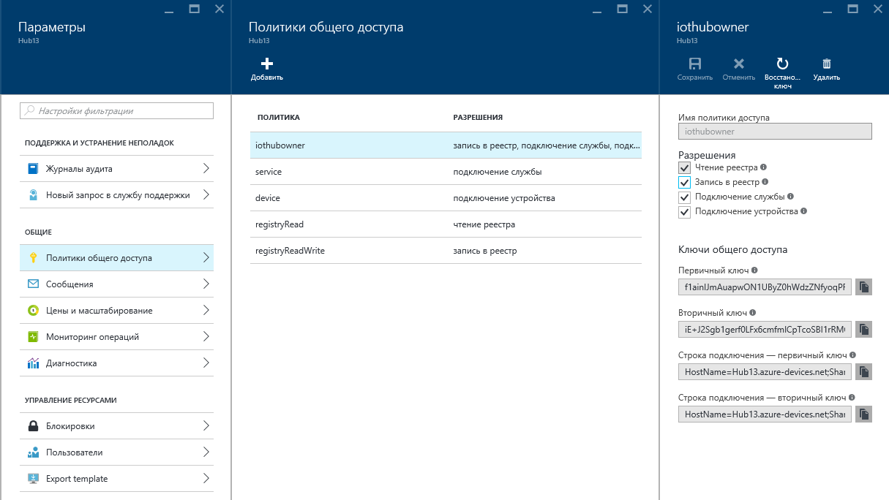
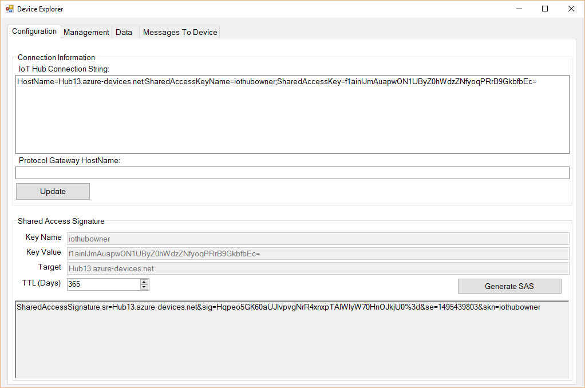
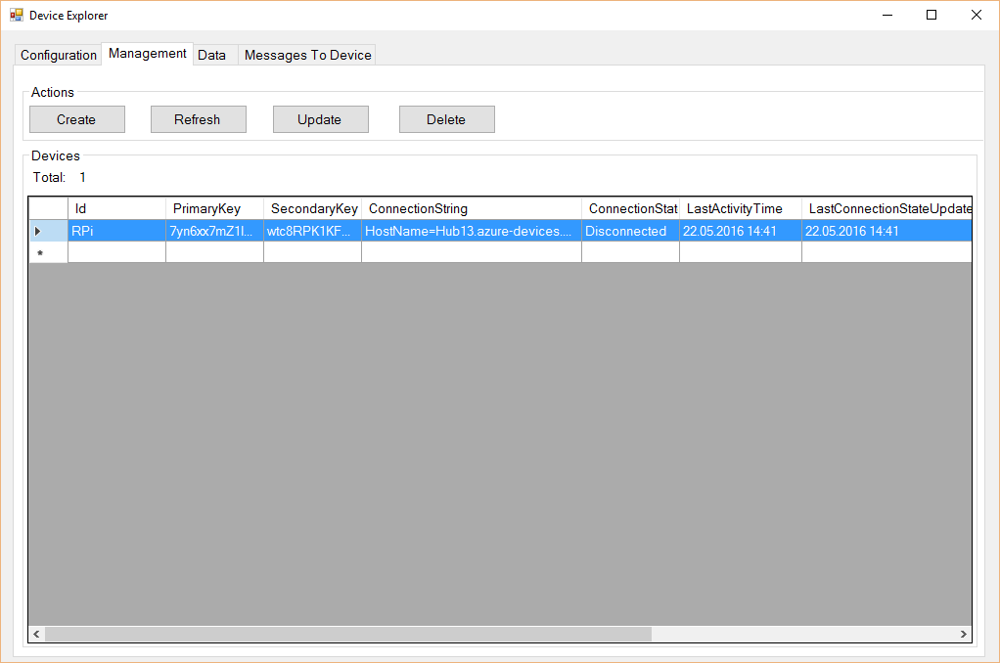

# Arduino-WebAPIGateway-IoTHub
This sample project demonstrates posting messages from Arduino board to IoT Hub via simple WebAPI Gateway

## Создаём IoT Hub в облаке

Для начала создаем в облаке свой IoT Hub (раздел "Интернет вещей"). После создания хаба скопируйте строку подключения:



Используйте и установите [Device Explorer](https://github.com/Azure/azure-iot-sdks/blob/master/tools/DeviceExplorer/doc/how_to_use_device_explorer.md). В нем введите
строку подключения к IoT-хабу:



После этого перейдите на вкладку "Management" и добавьте новое устройство. Затем правой кнопкой нажмите на строку с устройством и выберите "Copy Connection String".



## Разворачиваем в облаке WebAPI Gateway

В исходном коде WebAPI Gateway необходимо внести правильную строчку подключения к IoT Hub (полученную в предыдущем пункте)
в файл `Web.Config`:

```
<configuration>
  <appSettings>
    <add key="HubConnectionString" value="..."/>
```

После этого можно развернуть Web API Gateway в облаке как Azure Web App. Если приложение будет развёрнуто по адресу
`http://webapigateway.azurewebsites.net/`, то следующий запрос:
`http://webapigateway.azurewebsites.net/gw/hub/secret?temp=10&id=dev1` приведёт к отправке в IoT Hub такого JSON-сообщения:
`{"temp":"10","id":"dev1"}`.

Здесь `secret` - это некоторая секретная последовательность символов, валидность которой проверяется в файле
`Controllers/HubController.cs`. В идеале хорошо бы добавить проверку на допустимые поля в строке запроса, но это пока
не делается.

## Приложение для Arduino

Здесь также приводится пример скетча для Arduino, который посылает данные о температуре раз в 10 минут, но если посылка была
неуспешной - продолжает попытку с интервалами в 1 минуту.
